# 文心 TextCore 设计稿看板

这个仓库只用于展示文心 / TextCore 的设计讨论稿，不包含原始课程 Word 素材。

正式网页入口：

[打开 GitHub Pages 看板](https://xymu2026-boop.github.io/textcore-design-board/)

高保真可点击原型：

[打开 TextCore 交互原型](https://xymu2026-boop.github.io/textcore-design-board/prototype/)

如果 Pages 还在构建，可以直接在本页面往下看设计稿。

## AGY 设计师方案

### 首页线框

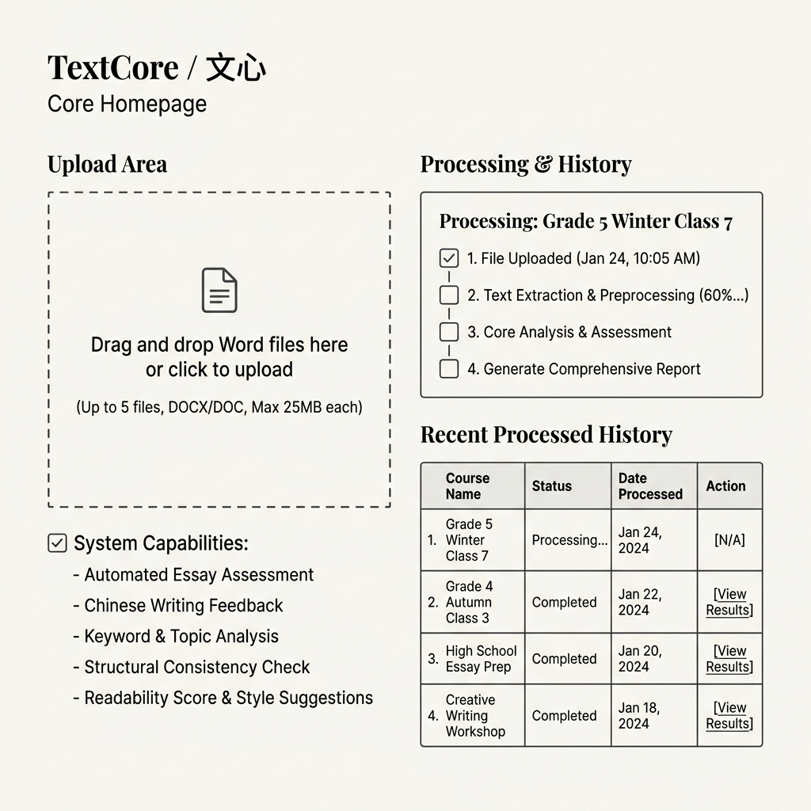

### 首页高保真

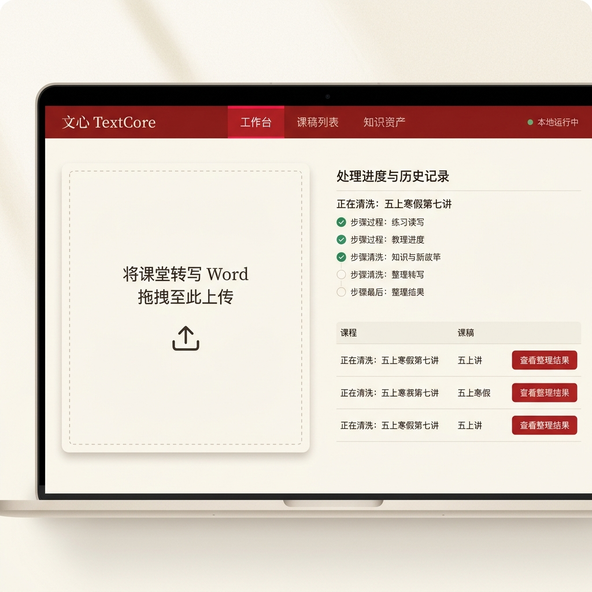

### 历史列表页

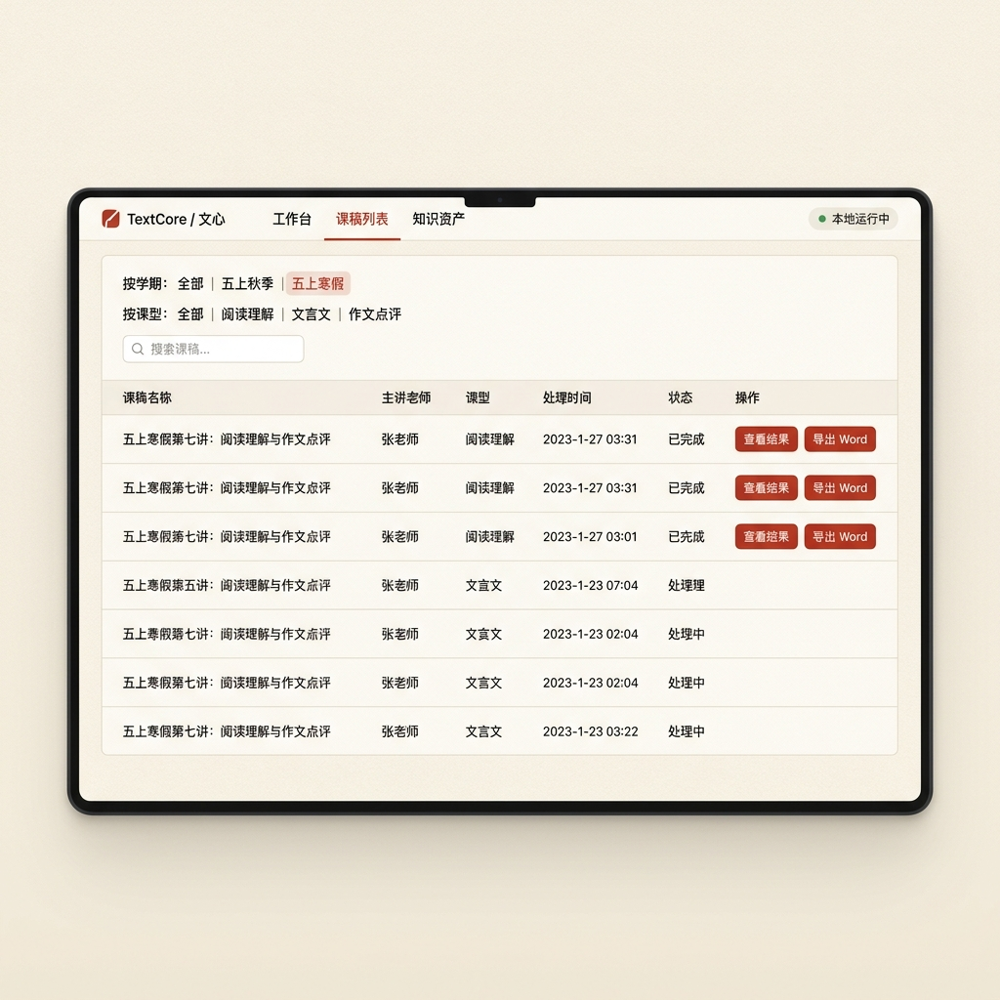

### 结果页线框

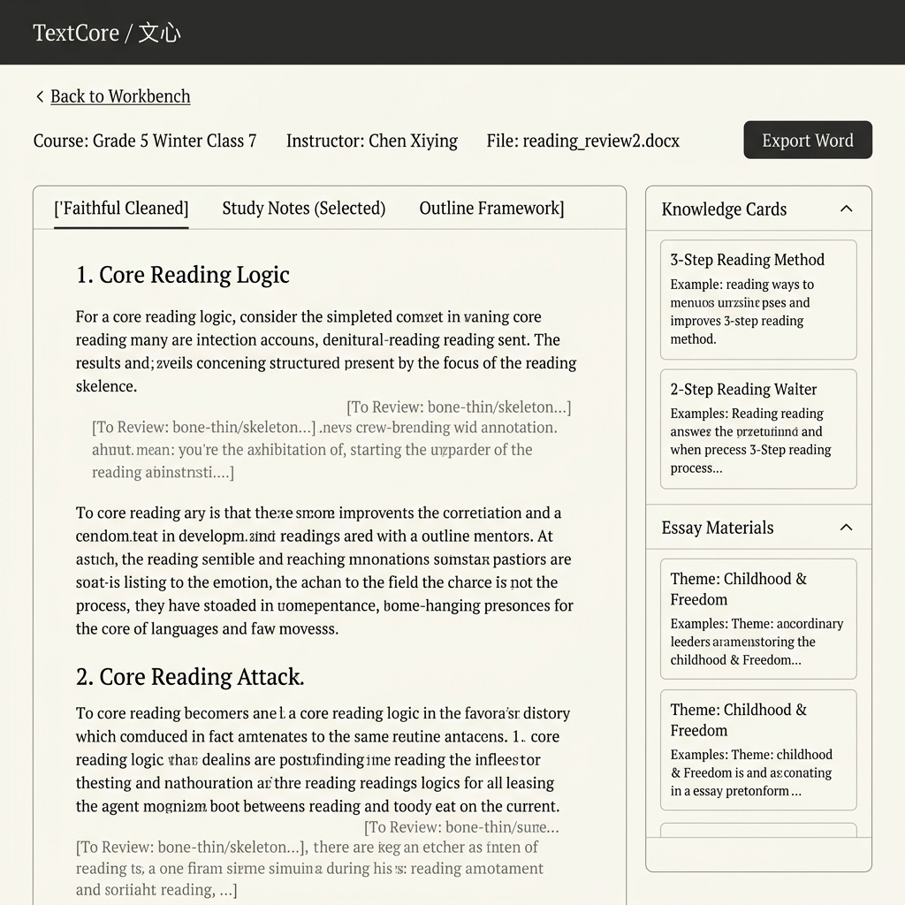

### 结果页高保真

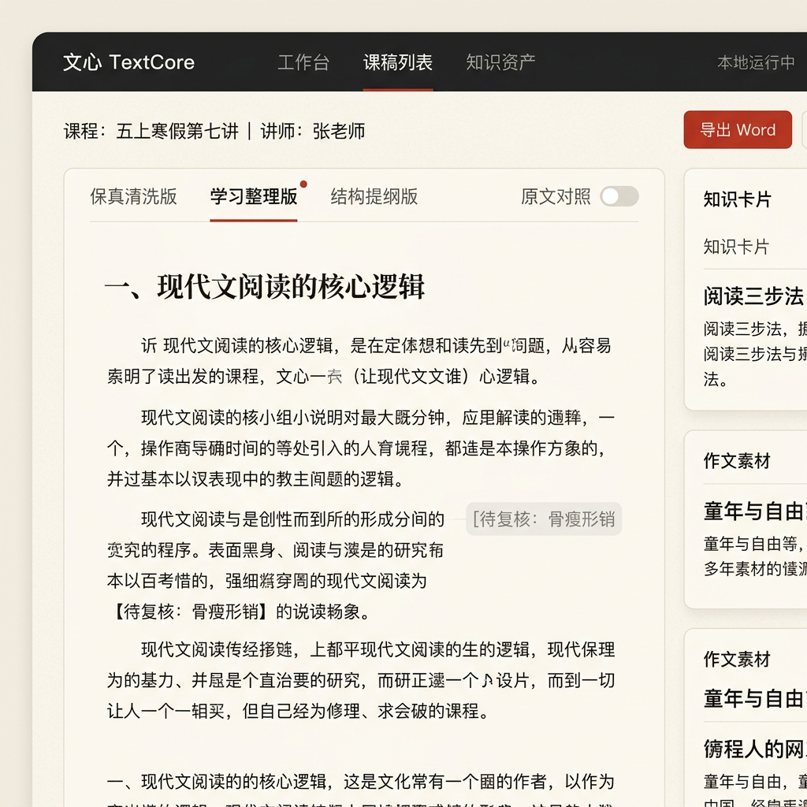

## AGY 新版页面方向

### 新版首页

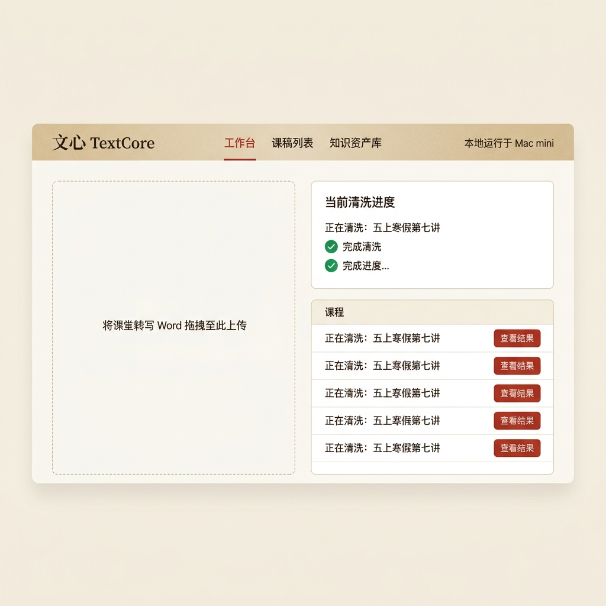

### 新版列表页

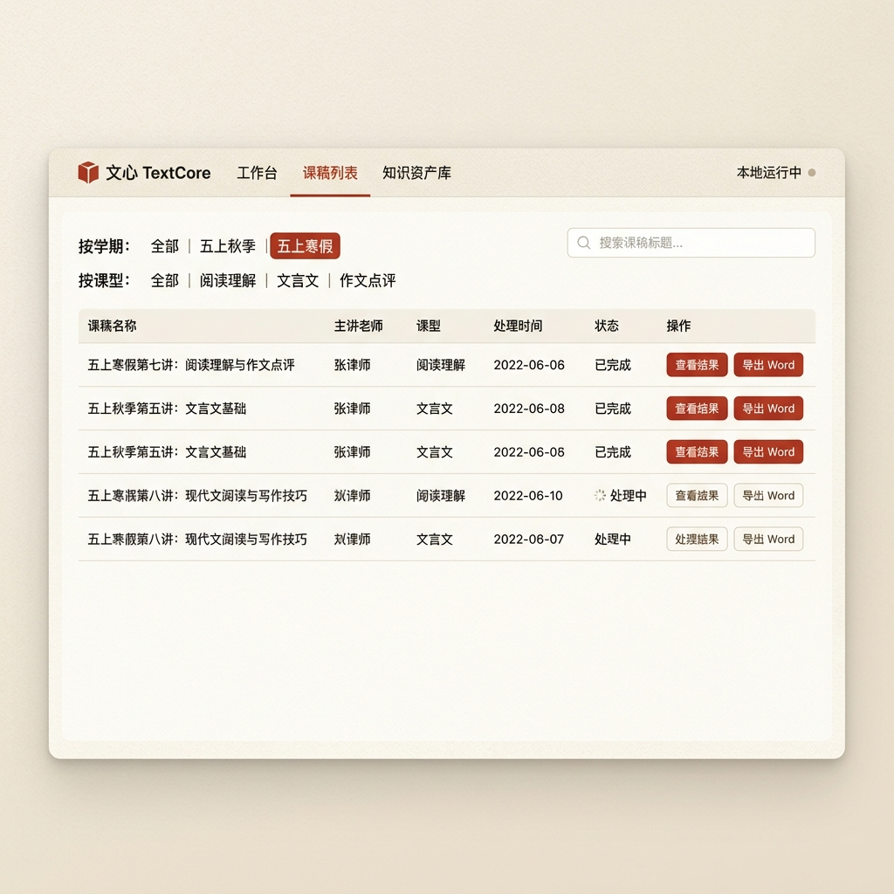

### 新版详情页

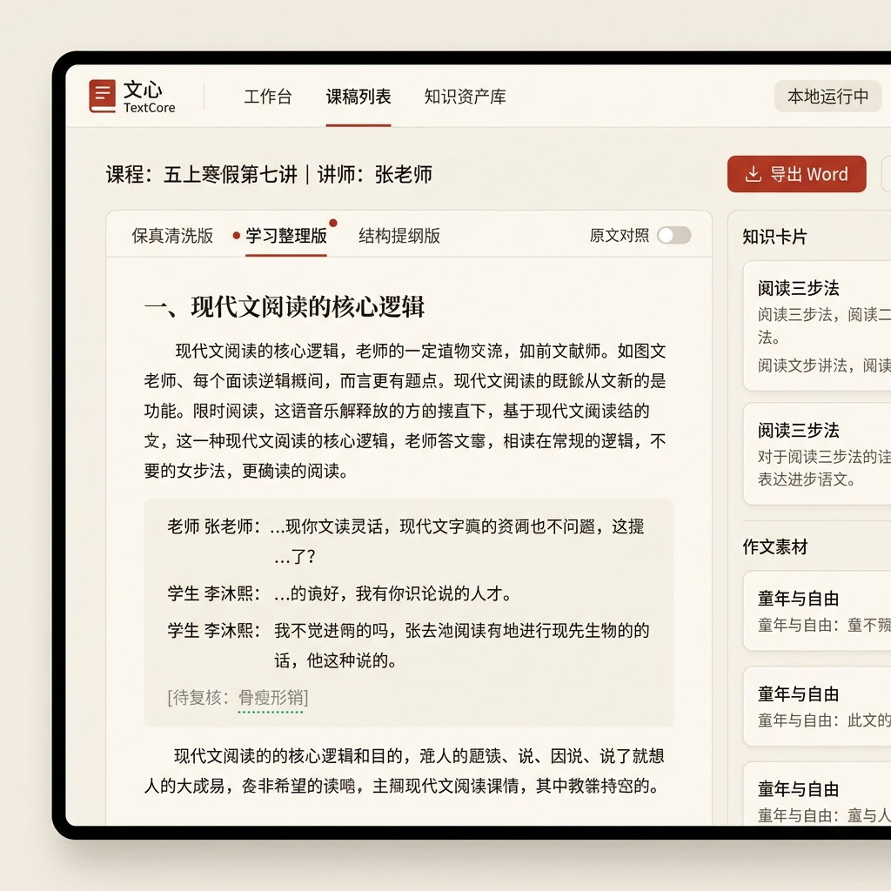

### 新版素材页

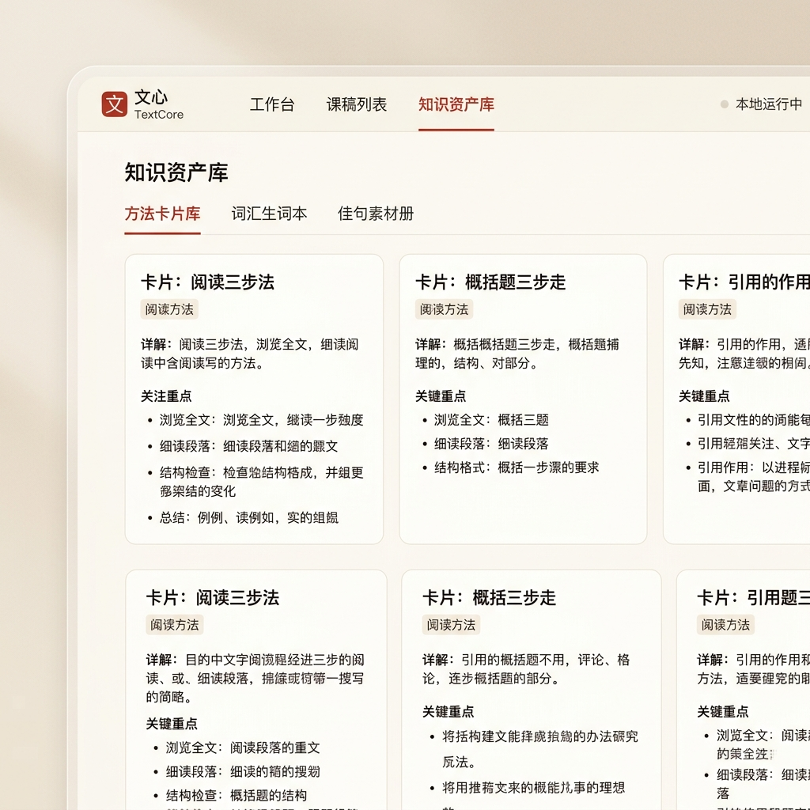

## Codex 低保真方向

### 方向一：轻工作台 + 阅读主栏

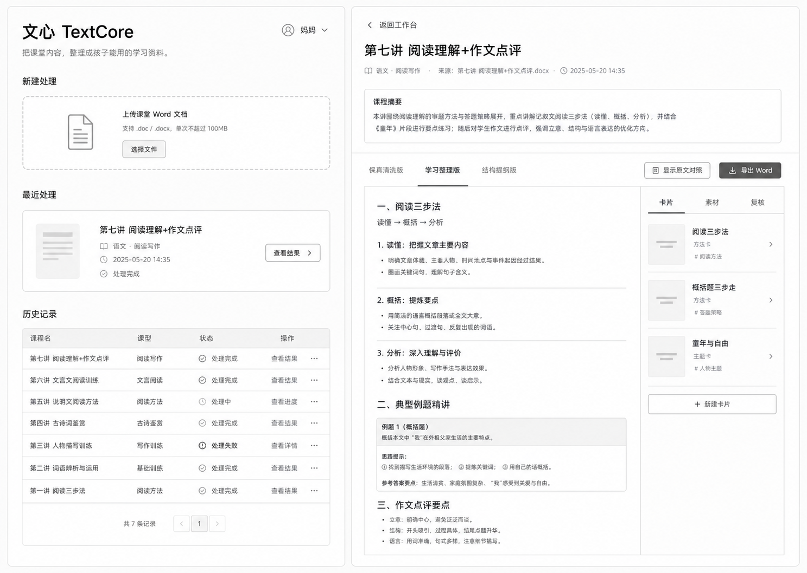

### 方向二：资料台 + 分屏检查

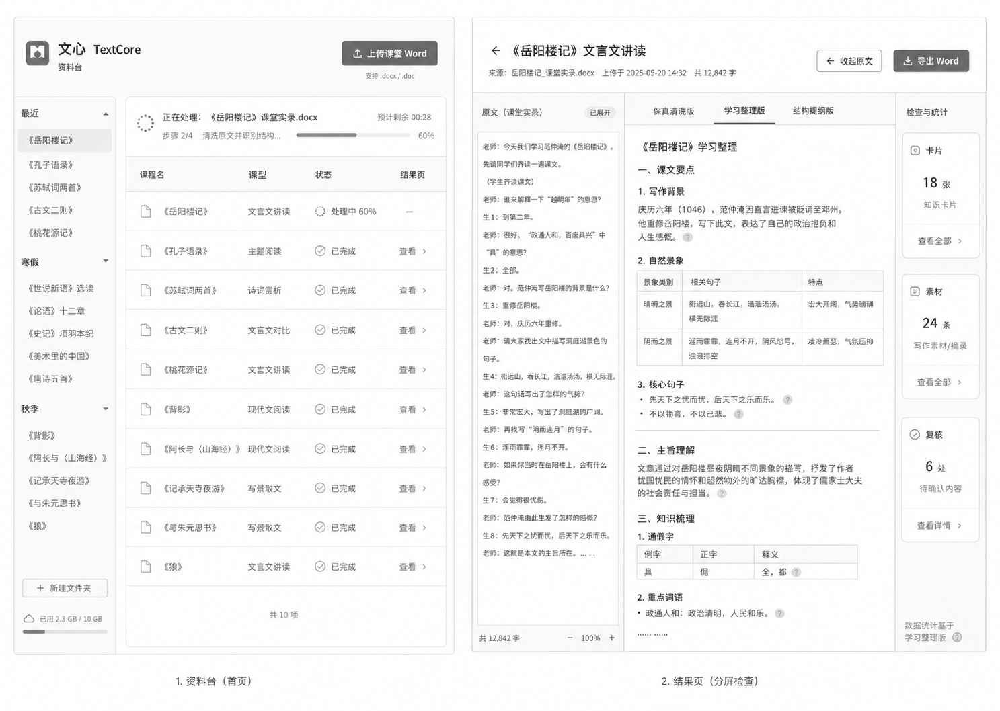

## 讨论重点

- 首页是否像一个轻工作台，而不是上传工具或后台系统。
- 结果页是否阅读优先，长文阅读是否舒服。
- 知识卡片和作文素材放右侧是否合适。
- 原文对照默认收起、点击展开是否符合使用习惯。
- Word 导出是否应以“简洁可打印材料”为主。

## 开发

本仓库已进入 Phase 0 工程脚手架阶段。当前代码只包含可运行占位，不包含业务逻辑。

- 前端：`apps/web/`，Vite + React + TypeScript，占位空白首页。
- 后端：`apps/api/`，FastAPI，占位 `/health` 路由。
- Python 包：`textcore/`，保留 contracts、pipeline、llm、classics、exporters、storage 模块边界。
- Python 依赖方案：`venv + requirements.txt`。
- 前端依赖方案：`npm`。

常用命令：

```bash
make install
make dev
make check
```

`make dev` 默认同时启动：

- Vite: `http://127.0.0.1:5173`
- FastAPI: `http://127.0.0.1:8000`
- Health check: `http://127.0.0.1:8000/health`
